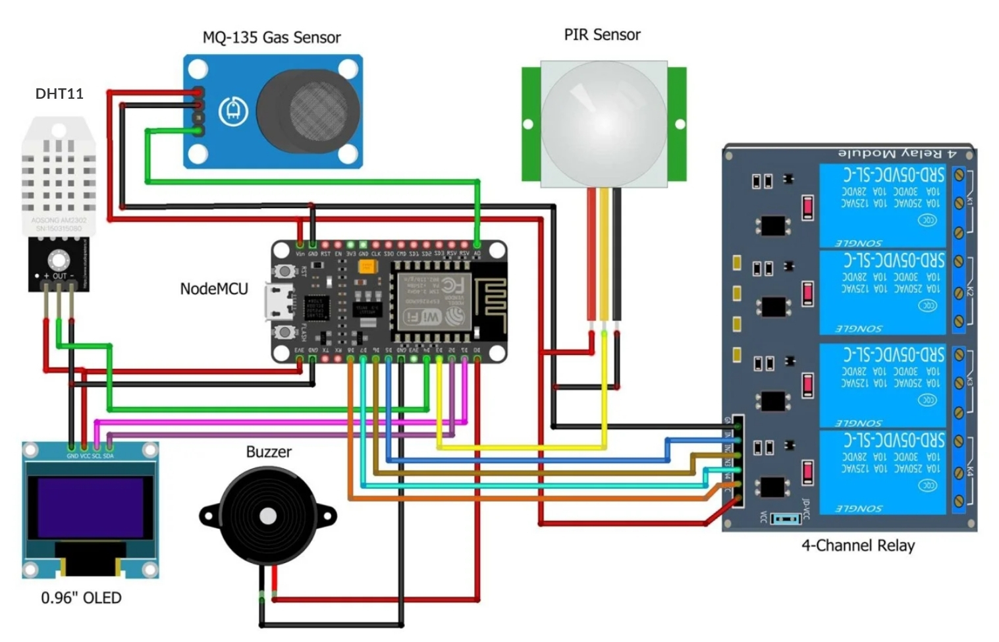
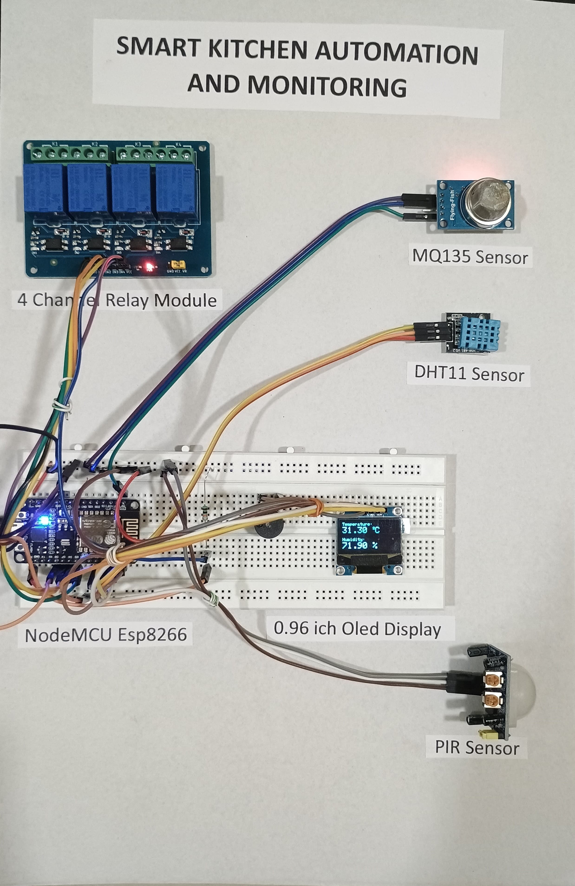
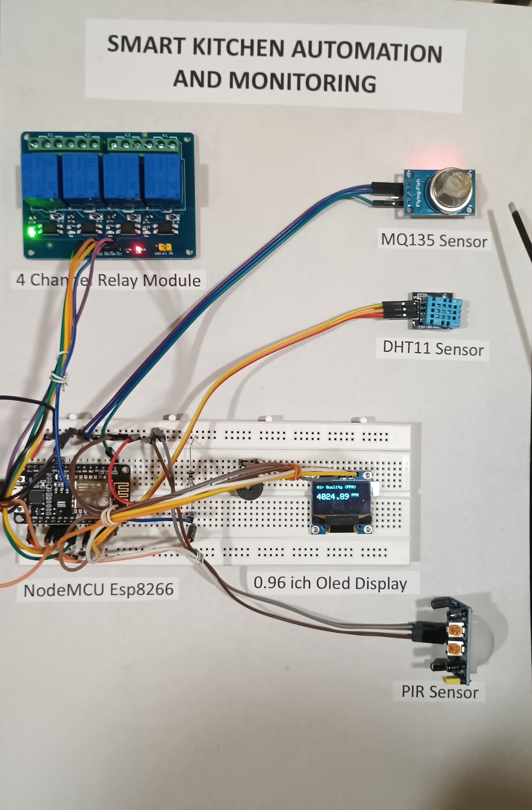
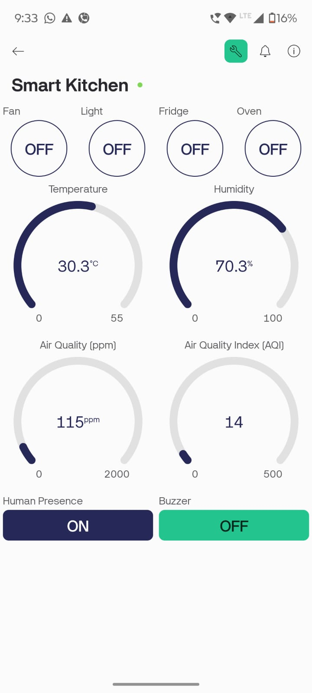
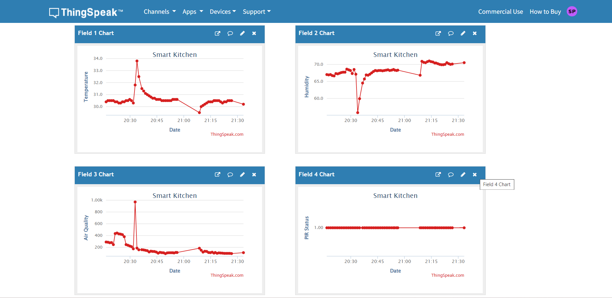

# Smart-Kitchen-Automation-and-Monitoring

## Overview
The Smart Kitchen Automation and Monitoring System is an IoT-based solution designed to enhance kitchen safety, efficiency, and convenience. It integrates multiple sensors with a NodeMCU ESP8266 microcontroller to detect hazards like gas leaks, fire, and abnormal temperature levels. The system also provides automation features such as activating exhaust fans or switching off appliances to prevent accidents and conserve energy.

## Objectives
- Detect hazards such as gas leaks, fire, and abnormal temperatures.
- Monitor environmental conditions (temperature, humidity, and gas levels).
- Detect human presence using motion sensors.
- Enable remote monitoring and control via mobile apps.
- Provide real-time alerts and notifications to users.
- Enhance energy efficiency through automated appliance control.
- Improve user interaction with a user-friendly interface.

## Hardware Requirements
- **NodeMCU (ESP8266-based microcontroller):** Central control unit.
- **Temperature and Humidity Sensor (DHT11):** Measures temperature and humidity.
- **MQ135 Gas Sensor:** Detects harmful gases (LPG, CO2, NH3, Benzene, etc.).
- **PIR Sensor (HC-SR501):** Detects human presence.
- **4-channel Relay Module:** Controls connected appliances (fans, alarms, etc.).
- **0.96" OLED Display:** Shows real-time sensor data.
- **Buzzer (5V):** Provides audible alerts.
- **PCB/Breadboard:** For circuit assembly.

## Software Requirements
- **Arduino IDE:** For programming NodeMCU ESP8266.
- **ESP8266 Board Package:** Adds ESP8266 support to Arduino IDE.
- **DHT & OneWire Libraries:** For interfacing with DHT11 sensor.
- **Blynk IoT Platform (Optional):** Mobile app to monitor and control the system remotely.
- **ThingSpeak (Optional):** IoT analytics platform to visualize sensor data in real time.
- **Fritzing or Tinkercad:** For creating and simulating circuit diagrams.

## Circuit Diagram

## Workflow
1. **Sensor Data Collection:** NodeMCU reads data from sensors (DHT11, MQ135, PIR).
2. **Hazard Detection:** If gas concentration exceeds threshold or motion/flame is detected, buzzer and exhaust fan are triggered.
3. **Automation Control:** Relay module automatically switches on/off appliances based on sensor data.
4. **Cloud Integration:** Sensor data is sent to Blynk or ThingSpeak for remote monitoring.
5. **User Alerts:** Real-time notifications are sent to the user’s smartphone.

## Implementation Photos
### Initial Setup

### Gas Leak Detected

### Blynk Integration

### ThingSpeak Dashboard

